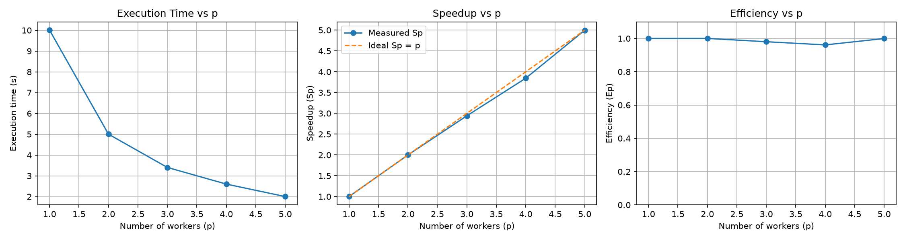

# Lab-1 — Thread Temelleri, Senkronizasyon ve Process Paralelliği

**Ad Soyad:** Boray Alçıntır
**Tarih:** YYYY-MM-DD
**Kod:** [`../../Lab-1/`](../../Lab-1/)

> Bu dosya raporun iskeletidir; yazdığın rapor metnini buraya taşı.
> Şablonun tamamı için: [`../REPORT_TEMPLATE.md`](../REPORT_TEMPLATE.md)

## Test Ortamı

| | |
|---|---|
| CPU | |
| Fiziksel / mantıksal çekirdek | |
| İşletim sistemi | |
| Derleyici | g++, `-std=c++20 -O2 -pthread` |
| Tekrar sayısı | 2 |

## İçerik

| Bölüm | Konu | Kod |
|---|---|---|
| 1 | Thread oluşturma ve `join()` | [`Example1`](../../Lab-1/Example1/) |
| 2 | Sequential vs. threaded çalışma süresi | [`Example2`](../../Lab-1/Example2/) |
| 2B–C | Speedup ve efficiency ölçümü | [`Example2-Part-BandC`](../../Lab-1/Example2-Part-BandC/) |
| 3 | Deadlock ve lock ordering ile çözümü | [`Example3`](../../Lab-1/Example3/) |
| 4 | Race condition ve mutex ile korunma | [`Example4`](../../Lab-1/Example4/) |
| 5 | Producer–consumer, condition variable | [`Example5`](../../Lab-1/Example5/) |
| 6 | `fork()` ile process paralelliği | [`Example6`](../../Lab-1/Example6/) |
| 7 | Matris çarpımı: thread vs. process + `mmap` | [`Example7`](../../Lab-1/Example7/) |
| 8 | `std::barrier` ile fazlı senkronizasyon | [`Example8`](../../Lab-1/Example8/) |
| 9 | Map-reduce (`fork` + paylaşımlı bellek) | [`Example9`](../../Lab-1/Example9/) |
| 10 | CPU-bound vs. I/O-bound: thread pool / process pool | [`Example10`](../../Lab-1/Example10/) |

## Speedup & Efficiency Ölçümü (Example 2, Part B–C)

50 görev, her biri 200 ms uyku; `p` worker thread arasında paylaştırıldı.

| p | Tp (s) | Sp = T1/Tp | Ep = Sp/p |
|---|---|---|---|
| 1 | 10.0071 | 1.000 | 1.000 |
| 2 | 5.0032  | 2.000 | 1.000 |
| 3 | 3.40258 | 2.941 | 0.980 |
| 4 | 2.60268 | 3.845 | 0.961 |
| 5 | 2.00262 | 4.997 | 0.999 |

**Yorum:** _(buraya yaz)_ — görev I/O/uyku ağırlıklı olduğu için speedup neredeyse
ideal `Sp = p` doğrusunu takip ediyor; CPU-bound bir iş yükünde aynı davranışın
neden beklenmeyeceğini tartış.

## Diğer Bölümler

_(rapor metnini buraya ekle)_

## Sonuç

_(çıkarılan dersler)_
